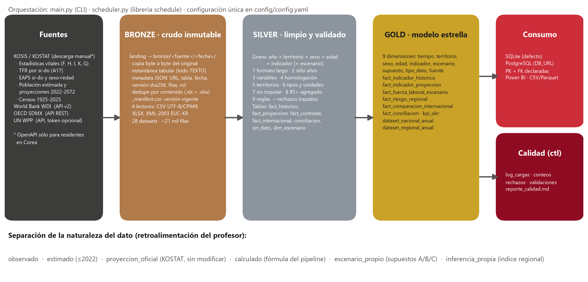
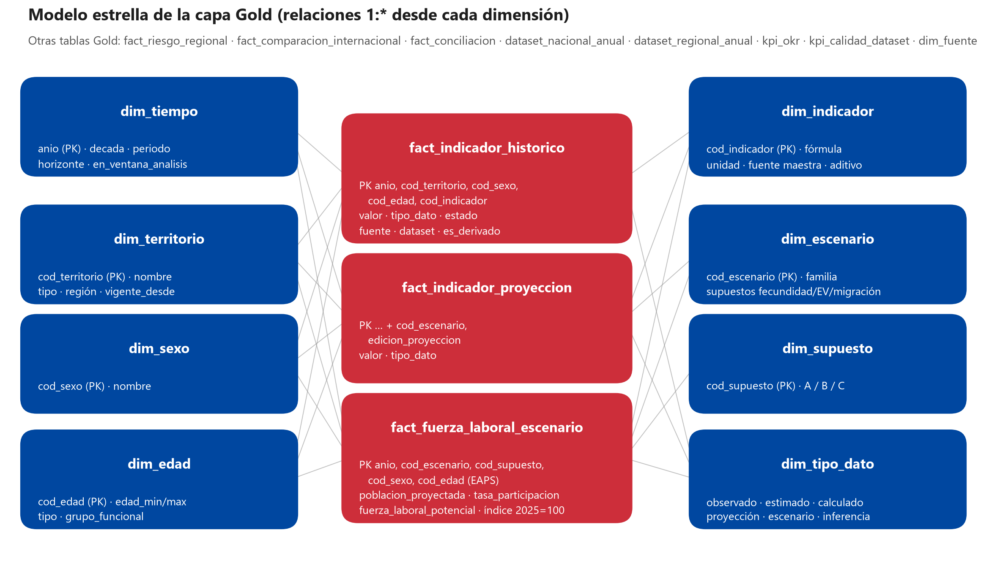

# ETL Corea del Sur · Natalidad, envejecimiento y fuerza laboral

**Proyecto ETL 2026 · Grupo 6** · Repositorio: <https://github.com/angietrduque/Proyecto_Final_ETL> · Maestría en Inteligencia Artificial y Ciencia de Datos · Universidad Autónoma de Occidente (Cali)
Angie Tatiana Rodríguez Duque · Karin Stephany Parra Rosero · Maicol Andrés Narváez Rincón · Miguel Ángel Méndez Rodríguez

> **Pregunta central:** ¿Cómo impactará la disminución de la natalidad y el envejecimiento poblacional en la
> disponibilidad futura de la fuerza laboral en Corea del Sur?



## 1. Problema de negocio
Corea del Sur tiene la fecundidad más baja del mundo (TFR **0,72 en 2023**, 0,80 en 2025) y uno de los envejecimientos
más rápidos. Los nacimientos cayeron **60 %** entre 2000 y 2025 y desde 2020 mueren más personas de las que nacen.
Gobierno, analistas y empresas necesitan una base **integrada, trazable y validada** que distinga lo observado de lo
proyectado para anticipar la escasez de fuerza laboral. El árbol de problemas y el contexto están en el Avance 1.

## 2. OKR y KPIs
Tres objetivos orientados al problema de estudio y uno habilitador de calidad del dato:

| Objetivo | Resultados clave (logrado) |
|---|---|
| **O1 · Diagnóstico** de la caída de la natalidad y el envejecimiento | serie integrada (completitud 96 % / 97 %) · 6 indicadores validados vs KOSTAT (dif. ≤ 0,37 %) · brecha vs OCDE (TFR 46 % menor) |
| **O2 · Impacto laboral** 2025-2072, separando proyección y escenarios | 29 escenarios KOSTAT · 3 escenarios propios calibrados (+1,5 %) · Pob 15-64 −27 % a −36 % y fuerza laboral −5,5 % a −12,2 % a 2050 |
| **O3 · Decisión**: dónde y con qué palancas actuar | 17 si-do con índice de riesgo (6 alto) · palancas: migración +7,7 pp, participación +6,7 pp, fecundidad +1,4 pp · tablero con 10 preguntas |
| **O4 · Calidad del dato** (habilitador) | 99,96 % válidos · 0,04 % rechazo trazado · 100 % conciliación · 3 fuentes |

14 KPIs de dominio, cada uno con una fórmula, último valor, referencia y semáforo: TFR 0,80 · nacimientos −60 % ·
crecimiento natural −108.627 · 65+ 20,3 % · dependencia de vejez 29 → 77 · Pob 15-64 −32 % · reemplazo laboral 58 ·
participación 64,7 % · brecha de género 15,8 pp · fuerza laboral potencial −12,2 % · 6 si-do en riesgo alto, entre otros.

Detalle y trazabilidad: [`docs/kpi_trazabilidad.md`](docs/kpi_trazabilidad.md).

## 3. Fuentes de datos (una maestra por indicador)
| Fuente | Acceso | Rol |
|---|---|---|
| KOSIS / KOSTAT: estadísticas vitales (DT_1B8000F/H/I/K/G), TFR (DT_1B81A17), EAPS (DT_1DA7004S, DT_1DA7012S), población y proyecciones (DT_1BPA001, DT_1BPB001, 28 escenarios alternativos + medio, DT_1BPA002), censos (DT_1IN1502, DT_1IN0001) | Descarga manual (OpenAPI restringida a residentes en Corea), versionada en `data/landing/kosis` | Maestra demográfica y laboral |
| OECD SDMX | API | Maestra de productividad (PIB/hora); contraste |
| World Bank WDI | API | Comparación internacional; contraste |
| UN WPP 2024 | API con token (opcional) | Contraste (omitido si no hay token) |

Análisis completo (periodicidad, cobertura, problemas, limitaciones): [`docs/fuentes_datos.md`](docs/fuentes_datos.md).

## 4. Arquitectura Medallion y flujo ETL
* **Bronze** — copia inmutable de cada crudo + instantánea tabular en texto + metadata (URL, fecha, sha256) + manifest de versiones; dedupe por contenido.
* **Silver** — grano único *año × territorio × sexo × edad × indicador [× escenario]*; melt, filtros de periodo y alcance, homologación, tipos/unidades, 85+; reglas de aceptación con rechazos trazados; consistencia y conciliación.
* **Gold** — esquema estrella (9 dimensiones, 5 hechos), escenarios de fuerza laboral A/B/C, índice de riesgo regional, KPIs y datasets planos; carga SQL con PK/FK.

Diseño y justificación de cada decisión: [`docs/02_diseno.md`](docs/02_diseno.md) · Linaje: [`docs/lineage/linaje_datos.md`](docs/lineage/linaje_datos.md).

## 5. Modelo de datos

Diccionario (generado desde las tablas): [`docs/data_dictionary/diccionario_datos.md`](docs/data_dictionary/diccionario_datos.md) (+ `.xlsx`).

**Naturaleza del dato** (`tipo_dato`): `observado` · `estimado` (población ≤ 2022) · `calculado` (fórmula del pipeline) ·
`proyeccion_oficial` (KOSTAT sin modificar) · `escenario_propio` (supuestos A/B/C, no es pronóstico) · `inferencia_propia` (índice regional).

## 6. Controles de calidad
Tipos, nulos (separados y clasificados, sin imputar), duplicados, rangos, fechas, integridad referencial (Silver + FK en la
base), consistencia interna (Σ si-do = nacional, H+M = T, Σ edades = total, PEA = ocupados + desocupados, tasas
recalculadas con tolerancia de redondeo), conciliación entre fuentes y conteo antes/después de cada paso.
Reporte automático: [`docs/reporte_calidad.md`](docs/reporte_calidad.md).

## 7. Cómo ejecutar
```bash
python -m venv .venv
```
```bash
.venv\Scripts\activate
```
```bash
pip install -r requirements.txt
```
```bash
python main.py
```
Opciones: `--sin-api` (no consulta APIs), `--capa silver|gold`, `--sin-db`, `--fuente kosis oecd`.
PostgreSQL: copiar `.env.example` a `.env` y definir `DB_URL`. Programación periódica: `python scheduler.py`.
Pruebas: `pytest -q` (25 pruebas). Notebooks (se regeneran con salidas): `python notebooks/construir_notebooks.py`.

Para agregar una descarga de KOSIS: guardar el archivo en `data/landing/kosis/` con el patrón del catálogo
(`config/config.yaml → kosis.datasets`) y volver a ejecutar; Bronze crea una versión nueva sin borrar la anterior.

## 8. Estructura
```
config/            config.yaml (autores, umbrales, catálogo) · mappings/ (dimensiones y homologación)
data/              landing/ · bronze/ · silver/ · gold/ · ctl/
src/ingestion/     lectores KOSIS · APIs · Bronze
src/transformation homologación · Silver · derivados · Gold
src/validation/    reglas · consistencia · KPIs · reporte
src/load/          carga SQL (SQLite/PostgreSQL) + DDL
src/analytics/     figuras · diagramas · diccionario
notebooks/         01 Bronze EDA · 02 Silver · 03 Gold · 04 Validación
tests/ · sql/ · docs/
```

## 9. Resultado final (hallazgos principales)
* La población 15-64 alcanzó su máximo en **2019 (37,6 M)**; KOSTAT proyecta **−32 % entre 2025 y 2050** (entre −27 % y −36 % según el escenario).
* La dependencia de vejez pasa de **29 (2025) a 77 (2050)** y supera 100 en 2072 (escenario medio).
* El índice de reemplazo laboral (15-24 / 55-64) cayó de 201 (2000) a 65 (2022): **entran 2 jóvenes por cada 3 que se acercan al retiro**.
* La fuerza laboral potencial cae **12 %** a 2050 si la participación no cambia; subir la participación (B) o cerrar la mitad de la brecha de género (C) la reduce a −5,5 % / −6,4 %, pero no evita la caída después de 2035.
* La migración es la palanca demográfica de efecto más rápido: migración cero vs alta = 8 pp de diferencia en la Pob 15-64 de 2050.
* Mayor riesgo regional: Busan, Daegu, Gyeongsangbuk-do, Jeonbuk; menor: Sejong, Jeju, Gyeonggi.

## 10. Limitaciones
* KOSIS sin API para no residentes → descarga manual (versionada y documentada).
* No hay población por edad **observada** 2023-2025 en las fuentes descargadas: se usa la proyección (rotulada).
* EAPS con grupos decenales y 60+ abierto → sesgo conocido del escenario de fuerza laboral (se reporta índice 2025 = 100 y calibración +1,5 %).
* Sin flujos migratorios anuales: la migración se analiza vía escenarios KOSTAT y población extranjera del censo.
* El índice regional es una inferencia propia con ponderación igual; asociación ≠ causalidad (productividad vs envejecimiento).
* UN WPP no se ejecutó (falta token); el pipeline lo soporta.

Documentos de entrega: [diagnóstico](docs/01_diagnostico.md) · [diseño](docs/02_diseno.md) ·
[retroalimentación](docs/retroalimentacion_trazabilidad.md) · [KPIs](docs/kpi_trazabilidad.md) · [validación](docs/03_validacion.md).
El tablero de Power BI (también en versión web HTML), la presentación y el informe final se entregan aparte del repositorio. Se regeneran desde la capa Gold con `python -m src.analytics.powerbi` (proyecto .pbip) y `python -m src.analytics.tablero_html` (página web interactiva sin conexión).
