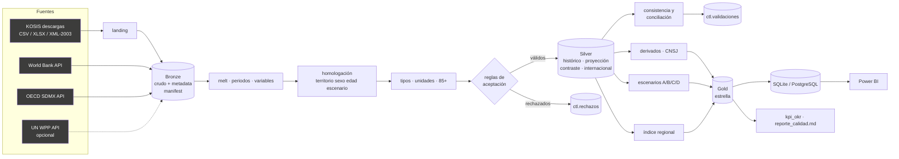

# Fase 2 — Diseño de la solución

## 1. Arquitectura Medallion y justificación


| Capa | Qué contiene | Por qué así |
|---|---|---|
| **Landing** (`data/landing/kosis`) | Descargas manuales de KOSIS tal como salen del portal | Bandeja de entrada: separa "lo que el equipo descargó" de "lo que el pipeline aceptó" |
| **Bronze** (`data/bronze/<fuente>/<fecha>/`) | Copia inmutable del crudo, instantánea tabular en texto, metadata JSON, `_manifest.csv` | Reprocesable y auditable: cualquier cifra de Gold se rastrea hasta un archivo con hash y fecha |
| **Silver** (`data/silver`) | Formato largo, códigos homologados, tipos y unidades, validado; histórico y proyección separados | Un grano único permite integrar 15 tablas heterogéneas sin columnas ad hoc |
| **Gold** (`data/gold` + SQL) | Esquema estrella, escenarios, índice regional, KPIs, datasets planos | Power BI consume tablas listas: relaciones simples y medidas sin transformaciones complejas |
| **ctl** (`data/ctl` + SQL) | Bitácora, conteos, rechazos, validaciones | Los KPIs de calidad se calculan, no se declaran |

**Decisiones técnicas**

| Decisión | Alternativa descartada | Justificación |
|---|---|---|
| Archivos Parquet por capa + base SQL | Sólo base de datos | Parquet es reproducible sin servidor; la base SQL cumple la rúbrica y sirve a Power BI |
| SQLite por defecto, PostgreSQL vía `DB_URL` | Sólo PostgreSQL (Docker) | El equipo no tiene Docker; SQLite permite **verificar** la carga (PK y FK activas). El mismo código crea esquemas en PostgreSQL |
| Formato largo en Silver | Tablas anchas por fuente | Las fuentes cambian de forma (años en columnas, encabezado doble); el largo absorbe nuevas variables sin cambiar el esquema |
| Indicadores derivados con fórmula propia | Tomarlos ya calculados | Las fuentes usan definiciones distintas (OCDE: 65+/20-64). Las fórmulas propias se validan contra KOSTAT (< 0,4 %) |
| Rechazar y trazar, no corregir en silencio | Imputar | Los datos son estadísticas oficiales: imputar inventaría datos |
| Escenarios propios como ejercicio contable | Modelo econométrico de pronóstico | La retroalimentación pide no presentar inferencias como proyecciones; un modelo contable es transparente y auditable |
| Índice regional con ponderación igual | Pesos elegidos a criterio | Sin un criterio externo, la ponderación igual es la menos arbitraria; se publican los componentes para re-ponderar en Power BI |

## 2. Flujo ETL



Ejecución: `python main.py` (completo, ~40 s) · `--sin-api` · `--capa silver|gold` · `--sin-db`; programado con
`scheduler.py` (librería `schedule`, frecuencia en `config.yaml`).

## 3. Modelo de datos (Gold)


Relaciones (todas 1 → *, filtro simple de la dimensión al hecho):

| Dimensión | Hechos relacionados | Clave |
|---|---|---|
| dim_tiempo | todos los hechos y datasets | anio |
| dim_territorio | historico, proyeccion, riesgo_regional, comparacion_internacional, datasets | cod_territorio |
| dim_sexo | historico, proyeccion, fuerza_laboral | cod_sexo |
| dim_edad | historico, proyeccion, fuerza_laboral | cod_edad |
| dim_indicador | historico, proyeccion, comparacion_internacional | cod_indicador |
| dim_escenario | proyeccion, fuerza_laboral | cod_escenario |
| dim_supuesto | fuerza_laboral | cod_supuesto |
| dim_tipo_dato | historico, proyeccion, fuerza_laboral | tipo_dato |

**Granularidad consistente:** cada hecho declara su grano y su clave primaria (ver diccionario). Los indicadores no
aditivos (tasas, índices) están marcados `aditivo = false` en `dim_indicador`: en Power BI se muestran con `AVERAGE`/`MAX`
filtrando un único territorio-sexo-edad, nunca con `SUM` entre territorios.

## 4. Estructura del repositorio

```
Proyecto_Final_ETL/
├── main.py · scheduler.py · requirements.txt · .env.example · .gitignore · README.md
├── config/config.yaml              autores, rutas, umbrales, catálogo de fuentes, escenarios
├── config/mappings/                territorios(+alias), edades(+alias), sexo, indicadores, items_kosis, escenarios
├── data/landing/kosis/             descargas manuales (versionadas)
├── data/bronze/ · silver/ · gold/ · ctl/
├── database/etl_corea.sqlite       base SQL (generada)
├── src/ingestion/                  lectores KOSIS, APIs, capa Bronze
├── src/transformation/             homologación, Silver, derivados, Gold
├── src/validation/                 reglas, consistencia, KPIs, reporte
├── src/load/sql.py                 carga SQLAlchemy (SQLite/PostgreSQL) + DDL
├── src/analytics/                  figuras, diagramas, diccionario
├── notebooks/01..04 + construir_notebooks.py
├── tests/                          pytest (ingesta, transformación, calidad, integración Gold)
├── sql/ddl_sqlite.sql · ddl_postgresql.sql
├── docs/                           diagnóstico, diseño, fuentes, trazabilidades, diccionario, linaje, figuras, reporte
└── (fuera del repositorio: ../powerbi con el tablero .pbix/.pbip y ../presentacion con la presentación y el guion)
```

Cambios frente al repositorio del grupo: se conserva el patrón de extracción por catálogo, hash y metadata; se agregan
landing, Silver, Gold, validación, carga SQL portable, documentación y pruebas; `src/extract`+`src/load/bronze.py` se
reorganizan en `src/ingestion` sin dependencia obligatoria de PostgreSQL.

## 5. Estrategia de calidad

| Control | Dónde | Resultado registrado |
|---|---|---|
| Tipos de datos | `reglas.aceptar` (tipo_valor) | rechazo + `ctl.validaciones` |
| Valores nulos | separación `sin_dato` con motivo esperado/inesperado | `silver/sin_dato`, KPI completitud |
| Duplicados | `duplicado_clave`, dedupe por hash en Bronze, unicidad integrada y PK en SQL | rechazo trazado |
| Rangos válidos | `rango_min/max` de `dim_indicador` | rechazo |
| Fechas | año entero en [1900, 2100]; periodos no anuales filtrados | rechazo / conteo |
| Integridad referencial | códigos ∈ dimensiones (Silver) + FK en la base | rechazo; `PRAGMA foreign_key_check` = 0 |
| Consistencia interna | Σ si-do = nacional, H+M=T, Σ edades = total, PEA = ocupados + desocupados, tasas recalculadas (tolerancia = error de redondeo) | `ctl.validaciones` |
| Consistencia entre fuentes | conciliación maestra vs contraste; fórmulas vs KOSTAT | `fact_conciliacion` |
| Registros inesperados | etiquetas no mapeadas → `__NO_MAPEADO__` → rechazo | rechazo |
| Conteos antes/después | cada paso de Silver y Gold | `ctl.conteos` |

## 5.1 Supuestos del escenario de fuerza laboral (detalle)

* Tasas base: EAPS 2025 por sexo y grupo (15-19, 20-29, 30-39, 40-49, 50-59, 60+).
* Población: KOSTAT por sexo y quinquenio, agregada a los grupos EAPS (60-64 … 85+ → 60+).
* **Factor de cobertura EAPS** (ajuste de escala): población 15+ de la EAPS / población KOSTAT en 2025, por sexo y grupo.
  La EAPS cubre la población civil no institucional (sin servicio militar ni instituciones); el factor más bajo es
  hombres 20-29 (≈ 0,88). Sin él el modelo queda +1,5 % sobre la PEA de 2025; con él coincide por construcción, por
  eso se presenta como ajuste y no como validación.
* **A** constante 2025 · **B** pendiente MCO 2015-2025 hasta 2035, luego constante, tope ±10 pp y [0, 95] ·
  **C** convergencia lineal a la tasa del promedio OCDE por sexo y edad, alcanzada en 2050 (15-19 y 60+ constantes) ·
  **D** cierre lineal del 50 % de la brecha H−M por edad entre 2025 y 2050, sin bajar nunca una tasa.
* Sensibilidad (`gold.fact_escenarios_sensibilidad`): B con tope 5/15 pp y horizonte 2030/2040; C con convergencia en
  2040/2060; D con cierre del 25 % / 100 %.
* Sesgo conocido: el grupo abierto 60+ envejece internamente (más 80+), por lo que A sobreestima la fuerza laboral
  mayor en el largo plazo; se reporta también el índice 2025 = 100.
* Índice de riesgo regional: 6 componentes z con peso igual; su robustez se prueba con 7 esquemas
  (`gold.fact_riesgo_sensibilidad`), incluido el índice de 4 componentes mínimo-máximo del repositorio de Miguel.

## 6. Trazabilidad de KPIs
Ver [`kpi_trazabilidad.md`](kpi_trazabilidad.md) y [`retroalimentacion_trazabilidad.md`](retroalimentacion_trazabilidad.md).
