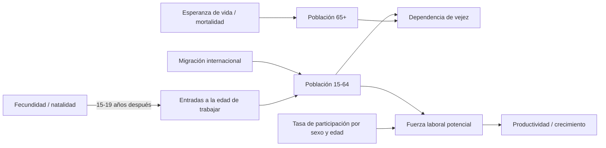

# Fuentes de datos: análisis, rol y limitaciones

Regla general (retroalimentación R3): **una fuente maestra por indicador**; las demás son de *contraste* (sólo
conciliación) o de *comparación internacional*. KOSIS es el portal de difusión de KOSTAT (Statistics Korea, hoy
*Ministry of Data and Statistics*): se trata como una sola institución.

Acceso: la OpenAPI de KOSIS está restringida a residentes en Corea, por lo que sus tablas se descargan manualmente desde
<https://kosis.kr/eng/>, se guardan en `data/landing/kosis/` y el pipeline las versiona en Bronze (sha256 + fecha).
World Bank y OECD se consultan por API pública; UN WPP requiere token (opcional).

## 1. Ficha por fuente

| Fuente / tabla | Información | Periodicidad | Cobertura | Unidad estadística | Variables usadas | Claves de integración | Problemas de calidad detectados | Transformaciones | Limitaciones |
|---|---|---|---|---|---|---|---|---|---|
| **KOSIS DT_1B8000F** Vital Statistics of Korea | Estadísticas vitales nacionales | anual | 1970-2025 | país-año | nacimientos, defunciones, TFR, tasas brutas, razón de sexo, mortalidad infantil, matrimonios, divorcios, esperanza de vida (T/H/M) | año | descargada en .xls y .xlsx (duplicado); "-" en mortalidad infantil < 2009 y esperanza de vida 2025 | melt, tipado, sexo desde el ítem (EV) | EV 2025 no publicada a la fecha de descarga |
| **KOSIS DT_1B8000I** Vital statistics city/county/district | Vitales por si-do | anual | 2000-2025 | si-do-año | nacimientos, defunciones, crecimiento natural, tasas, matrimonios, divorcios | año, si-do | fila "Abroad"; Sejong vacío < 2012 | encabezado doble → largo; homologación de nombres | la descarga sólo trae nivel si-do (suficiente) |
| KOSIS DT_1B8000H Vitals for Provinces | Igual que la anterior + TFR | anual | 1990-2025 **sin 2022** | si-do-año | contraste | año, si-do | **falta el año 2022** y la TFR de varios años | ídem | por eso no es maestra |
| KOSIS DT_1B8000G (mensual, repo) | Vitales mensuales y anuales | mensual/anual | 2000-2026.07 | si-do | contraste de nacimientos y TFR | año, si-do | columnas mensuales "p)"; nombres antiguos; "Jeonnam-Gwangju" | se descartan meses | — |
| KOSIS DT_1B8000K Births & deaths by sex | Nacimientos y defunciones por sexo | anual | 2004-2025 | si-do × sexo | nacimientos, defunciones por sexo | año, si-do, sexo | si-do sólo en la fila "Total" (celdas combinadas) | relleno hacia abajo documentado | sin sexo antes de 2004 |
| **KOSIS DT_1B81A17** TFR y ASFR | Fecundidad por si-do | anual | 2000-2025 | si-do | TFR (3 dec.) y tasas por edad de la madre | año, si-do, edad | "sejong-si" con otro nombre | ítems → TASA_FEC_EDAD con dimensión edad | — |
| **KOSIS DT_1DA7004S** EAPS por si-do | Mercado laboral | anual (promedio de meses publicado) + mensual | 2000-2025 | si-do | Pob 15+, PEA, ocupados, desocupados, inactivos, tasas | año, si-do | niveles en **miles**; Sejong desde 2017; "Jeonnam-Gwangju" 2025 | ×1000, meses fuera, rechazo de la región combinada | encuesta por muestreo: mayor error regional |
| **KOSIS DT_1DA7012S** EAPS sexo × edad | Mercado laboral nacional | anual | 2000-2025 | país × sexo × edad | ídem por sexo y edad | año, sexo, edad | grupos decenales, último abierto (60+); "Yeras" (sic) | homologación de edades EAPS | no comparable 1:1 con quinquenales |
| **KOSTAT DT_1BPA001** Población por edad (nacional) | Población estimada + proyección medio | anual | 2000-2072 | país × sexo × edad | población quinquenal | año, sexo, edad | agregado 80+ redundante; 85-89…100+ | 85+ agregado; ≤2022 → histórico, ≥2023 → proyección | 2023-2025 **no son observados** |
| **KOSTAT DT_1BPB001** Población por edad (provincial) | Ídem por si-do | anual | 2000-2052 | si-do × sexo × edad | población quinquenal | año, si-do, sexo, edad | Sejong vacío < 2012; columna vacía final | ídem | proyección provincial hasta 2052 |
| **KOSTAT** proyección por escenario | 28 escenarios alternativos | anual | 2022-2072 | país × sexo × edad | población | año, sexo, edad, escenario | CP949; "기타" = combinaciones | homologación de los 29 escenarios a códigos | el tblId no se registró al descargar |
| KOSTAT DT_1BPA002 indicadores resumen | Dependencia, envejecimiento oficiales | anual | 2022-2072 | país | contraste de fórmulas | año | en coreano | mapeo de ítems | sólo escenario medio |
| **KOSIS DT_1IN1502** Censo de registros | Población, extranjeros, hogares, viviendas | anual (desde 2015) | 2016-2025 | si-do / si-gun-gu | población total y extranjera, hogares | año, si-do | XML-2003 EUC-KR mal formado; nombres "Gangwon-State"; Sejong repetido | lector propio; sólo nivel si-do | referencia 1-nov (≠ mitad de año) |
| KOSIS DT_1IN0001 Censo histórico | Población por edad | quinquenal | 1925-2010 | si-do × edad | contexto | año, si-do, edad | provincias previas a 1945, grupos abiertos que cambian | fuera de alcance filtrado | excluye extranjeros |
| **World Bank WDI** (API v2) | Comparación internacional | anual | 2000-2025 | país | TFR, % 65+, población por grandes edades, dependencia, participación (OIT), esperanza de vida, PIB por ocupado | año, ISO3 | null en años recientes | KOR → '00'; nulos descartados | estimaciones ONU (no KOSTAT) |
| **OECD SDMX** (API) | Productividad, fuerza laboral, fecundidad | anual | 2000-2025 | país | **PIB por hora (maestra)**, PEA, ocupados, desempleo, TFR, nacimientos | año, ISO3 | CSV mezcla niveles, índices y crecimiento | filtros obligatorios por medida/unidad | dependencia OCDE = 65+/20-64 |
| UN WPP 2024 (API, token) | Proyección ONU | anual | 2000-2072 | país | contraste | año | — | — | **no ejecutado: sin token** (omitido, no es fallo) |

## 2. Fuente maestra por indicador

| Indicador | Maestra | Contraste | Nivel territorial |
|---|---|---|---|
| Nacimientos, defunciones, nupcialidad | KOSIS DT_1B8000F (nacional), DT_1B8000I (si-do) | DT_1B8000H, DT_1B8000G, OECD | país, si-do |
| TFR | DT_1B8000F (nacional), DT_1B81A17 (si-do) | WB, OECD, DT_1B8000H | país, si-do |
| Esperanza de vida, mortalidad infantil | DT_1B8000F | WB | país |
| Población por sexo y edad | KOSTAT DT_1BPA001 / DT_1BPB001 (≤ 2022) | WB, censo de registros | país, si-do |
| Proyección de población | KOSTAT 2022-2072 (29 escenarios) y 2022-2052 provincial | — (UN WPP opcional) | país, si-do |
| Indicadores de estructura (dependencia, envejecimiento…) | **Pipeline** (fórmula única) | KOSTAT DT_1BPA002, WB | país, si-do |
| Mercado laboral | KOSIS EAPS DT_1DA7012S (nacional) / DT_1DA7004S (si-do) | OECD, WB | país, si-do |
| Población extranjera | KOSIS DT_1IN1502 | — | país, si-do |
| Productividad | OECD Productivity Database | WB (PIB por ocupado) | país |

## 3. Relaciones entre las variables (por qué se integran)

Las variables incluidas son las que el árbol de problemas declara como causa o efecto **y** que tienen una fuente oficial
con la granularidad necesaria. Se excluyeron, por falta de una serie comparable descargada, el costo de vivienda y
educación y los flujos migratorios anuales; la migración se analiza con los escenarios oficiales de KOSTAT (migración
alta, baja y cero) y con la población extranjera del censo, sin inventar flujos.
