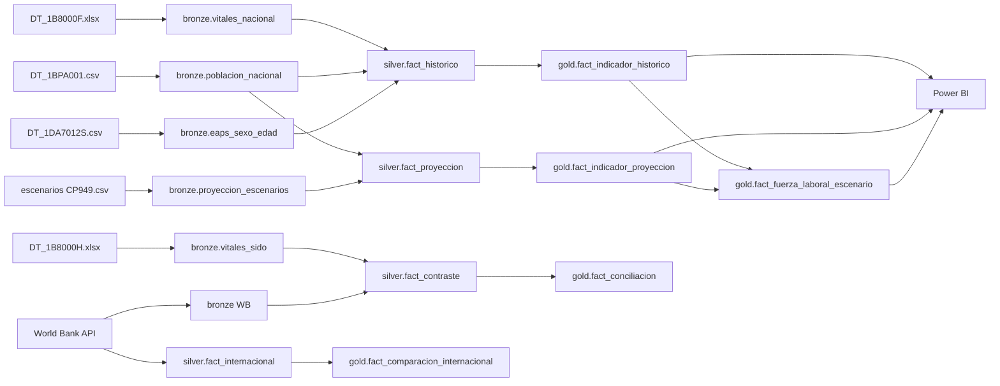

# Linaje de datos (data lineage)

Cada registro conserva su linaje en columnas: `fuente`, `dataset`, `tabla_fuente`, `version_fuente` (sha256 del
crudo) y `fecha_extraccion` (Silver); en Gold, `tipo_dato`, `fuente` y `dataset` (o la regla de cálculo).
El archivo crudo exacto se localiza con `data/bronze/_manifest.csv` → `archivo_crudo`.

## Linaje por indicador clave

| Indicador Gold | Archivo crudo (landing) | Bronze dataset | Pasos Silver | Cálculo Gold | Tabla Gold |
|---|---|---|---|---|---|
| TFR nacional | `Vital_Statistics_of_Korea_20261002100432.xlsx` (DT_1B8000F) | vitales_nacional | melt → ítem `Total fertility rate(persons)` → TFR → tipado | — | fact_indicador_historico |
| TFR si-do | `tfr_sido_2000_2025.csv` (DT_1B81A17) | tfr_sido | encabezado doble → largo → homologación si-do (`sejong-si` → 29) | BRECHA_REEMPLAZO = 2,1 − TFR | fact_indicador_historico, fact_riesgo_regional |
| Nacimientos si-do | `Vital_statistics_for_city__county__and_district_…xlsx` (DT_1B8000I) | vitales_sigungu | largo → "Abroad" fuera de alcance → tipado | agregado CNSJ | fact_indicador_historico |
| Población por edad | `poblacion_nacional_edad_sexo_2000_2072_medio.csv` (DT_1BPA001) | poblacion_nacional | largo → edades (85-89…100+ → 85+, 80+ excluido) → ≤2022 histórico / ≥2023 proyección | 0-14, 15-64, 65+; PROP_*, DEP_*, IND_* | fact_indicador_historico / _proyeccion |
| Escenarios | `proyeccion_nacional_edad_sexo_por_escenario_2022_2072.csv` (CP949) | proyeccion_escenarios | largo → escenario coreano → `cod_escenario` | derivados por escenario | fact_indicador_proyeccion |
| Participación laboral | `eaps_nacional_sexo_edad_2000_2025.csv` (DT_1DA7012S) | eaps_sexo_edad | meses fuera → miles × 1000 → edades EAPS | supuestos A/B/C | fact_indicador_historico, fact_fuerza_laboral_escenario |
| Fuerza laboral potencial | escenarios + EAPS | — | — | Σ P_proy × TP | fact_fuerza_laboral_escenario |
| Extranjeros | `101_DT_1IN1502_20261002094734.xls` (XML-2003) | censo_registros | lector XML → sólo nivel si-do → `Gangwon-State` → 32 | PROP_EXTRANJEROS | fact_indicador_historico |
| PIB por hora | API OECD `DSD_PDB@DF_PDB` | productividad | filtro TRANSFORMATION = N | — | fact_comparacion_internacional |

## Diagrama

